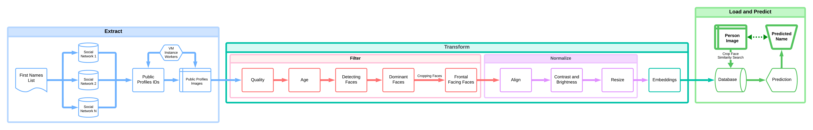

# Eagle Eye
This project presents a comprehensive framework for building a sophisticated facial recognition and name prediction pipeline. Rather than a finished product, it provides a flexible and modular architecture that developers can adapt and implement to create an advanced face recognition systems tailored to specific needs.

## Key components of the framework include:
### 1. Data Collection Module:
   - Provides tools and methodologies for creating an initial database of names, starting from a seed list of first names.
   - Offers strategies for scanning social networks to expand this list into full names.
   - Includes a distributed scraping system utilizing virtual machine instances for efficient, large-scale profile image collection.

### 2. Image Processing Pipeline:
   - Defines a series of image preprocessing steps including face detection, alignment, resizing, and quality filtering.
   - Offers customizable modules for normalization of brightness, contrast, and other image attributes.

### 3. Face Embedding Generation:
   - Incorporates deep learning models for generating face embeddings.
   - Allows for easy integration of different embedding models to suit various accuracy and performance requirements.

### 4. Scalable Database Architecture:
   - Provides a design for creating and managing an indexed dataset of face embeddings linked to corresponding names.
   - Includes file naming conventions and database schemas for efficient storage and retrieval.

### 5. Name Prediction System:
   - Offers algorithms for similarity searching within the embedding space.
   - Provides customizable methods for name prediction based on embedding similarities.

### 6. Distributed Computing Integration:
   - Includes designs for leveraging cloud computing and distributed systems to handle large-scale data processing and storage.

### 7. Ethical Considerations Module:
   - Incorporates guidelines and best practices for addressing privacy concerns and ethical use of collected data.
   - Provides frameworks for implementing consent mechanisms and data protection measures.

This framework enables developers to construct a pipeline that can collect data from social networks, process large volumes of facial images, create a searchable database of face embeddings, and predict names from new facial images. Its modular nature allows for customization at each stage, from data collection strategies to the choice of machine learning models for embedding generation and similarity matching.

# Complete Implementation Guide
## 1. Data Collection and Preparation

### - Create Initial Name Database:
Compile a list of 1000-5000 common first names.
Store these names in a CSV file or database.

### - Set Up Database:
Install and configure PostgreSQL.
Create tables for names, profiles, and image metadata.
Implement indexes on frequently queried fields.

### - Develop Social Network Scanners:
Create API integrations for Facebook, LinkedIn, Twitter, etc.
Implement search algorithms to find profiles using seed names.
Develop parsers to extract full names, usernames, and profile URLs.
Store extracted data in the database.

### - Set Up Distributed Scraping System:
Launch a cluster of virtual machines (e.g., on AWS EC2).
Install and configure Celery with Redis for task distribution.
Develop a central management script to coordinate scraping tasks.

### - Implement Profile Image Scrapers:
Develop separate scrapers for each social network.
Implement authentication and session management for each platform.
Create functions to navigate to profile pages and extract images.
Implement error handling and retry mechanisms.

### Set Up Image Storage:
Configure an S3 bucket or similar object storage.
Implement a naming convention for stored images (e.g., "firstname_lastname_source_id.jpg").
Develop functions to upload images and link them to database entries.

### Manage Scraping Process:
Implement rate limiting and request throttling in scrapers.
Set up a proxy rotation system to avoid IP bans.
Create logging and monitoring systems for scraping progress.

## 2. Image Processing and Face Alignment
### - Install required libraries: OpenCV, MediaPipe, NumPy, Pandas.
### - Implement face detection:
Use MediaPipe's Face Mesh to detect faces in images.

### - Develop face alignment function:
Calculate eye positions from facial landmarks.
Determine the angle for rotation.
Apply an affine transformation to align the face.

### - Create oval face cropping function:
Use facial landmarks to define an oval mask.
Apply the mask to isolate the face region.

### - Implement brightness and contrast normalization:
Convert image to LAB color space.
Apply CLAHE to the L channel.
Convert back to BGR color space.

### - Set up batch processing:
Process images in batches for efficiency.
Add grayscale conversion option.

### Implement file handling:
Create output directories for processed images.

## 3. Gender and Age Classification
### - Install required libraries: PyTorch, Transformers.
Download pre-trained models for gender and age classification.
Implement image loading and preprocessing functions.

### - Create gender classification function:
Use the gender model to predict gender.
Implement a confidence threshold for male classification.

### - Develop age classification function:
Use the age model to predict age range.
Implement logic to categorize into groups (child, adult, old).
Set up a system to move classified images into corresponding folders.
Implement batch processing for efficiency.
Add error handling for image processing issues.

## 4. Face Search Application
### - Install required libraries: PyQt6, Boto3, FaceNet-PyTorch.
Set up AWS account and configure Rekognition access.

### - Implement face detection using MTCNN:
Set up MTCNN with appropriate thresholds.
Create a function to detect and crop faces from loaded images.

### - Develop AWS Rekognition integration:
Set up Boto3 client for Rekognition.
Implement function to search faces in Rekognition collection.

### - Create similarity search function:
Use Rekognition's SearchFacesByImage API.
Process and display results.

### - 5. Face Indexing for Cloud-Based Recognition
Set up AWS account with access to S3 and Rekognition.
Install required libraries: Boto3, Patoolib.

### - Implement RAR file extraction:
Use Patoolib to extract images from RAR file.

### - Set up AWS Rekognition client:
Configure with appropriate credentials and region.
Create a Rekognition Collection if not exists.
Implement face indexing function:
Loop through extracted images.
Use Rekognition's IndexFaces API to add faces to the collection.
Associate each face with metadata (e.g., filename as person's name).
Add error handling for AWS operations.
Implement filename sanitization to ensure compatibility with AWS.
Use tqdm to track indexing progress.
Set up logging to monitor the indexing process.

## 6. Ethical Considerations and Compliance

### - Implement Data Protection Measures:
Encrypt sensitive data at rest and in transit.
Implement access controls and authentication for all system components.

### - Develop Consent Management System:
Create a mechanism to track and manage user consents.
Implement functionality to honor data deletion requests.

### - Set Up Audit Logging:
Log all data access and processing activities.
Implement tools for generating compliance reports.

### - Create Privacy Policy:
Outline data collection, usage, and retention practices.
Provide information on user rights and how to exercise them.

### - Implement Data Minimization:
Only collect and retain necessary data.
Set up automated data deletion for outdated information.

### - Conduct Regular Privacy Impact Assessments:
Evaluate the system's impact on individual privacy.
Identify and mitigate potential risks.

### - Establish a Process for Handling Misuse:
Develop guidelines for identifying and responding to potential system misuse.
Create a mechanism for reporting and addressing concerns.

By following these steps, you can build a comprehensive facial recognition and name prediction system, from data collection through to the final application, while addressing important ethical and compliance considerations. Always adhere to legal requirements and best practices for data protection and privacy throughout the implementation process.

Importantly, this framework is designed with flexibility in mind, allowing implementers to adapt it to various use cases such as social media analysis, identity verification systems, or research applications. It provides the building blocks and architecture for creating a powerful facial recognition system, while leaving room for developers to make crucial decisions about implementation details, scale, and specific use cases.

The framework also emphasizes the importance of ethical considerations in its design, encouraging developers to carefully consider privacy implications and implement appropriate safeguards when building systems that handle personal data at scale.

By providing this comprehensive set of tools and methodologies, the framework empowers developers to create sophisticated facial recognition pipelines while addressing the complex technical and ethical challenges inherent in such systems.
